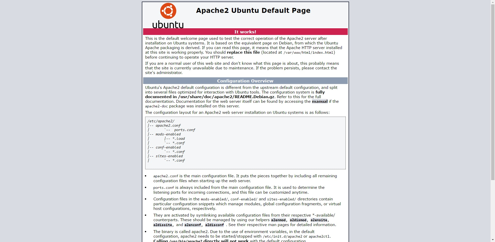

# Digital Ocean

Some documentation about creating an Ubuntu 16.04 droplet on Digital Ocean and installing the LAMP stack on it ( without the one-click app )

## 1. Creating a SSH keypair and setting it up on Digital Ocean

### 1.1 Generating the keypair

1. Go into the .ssh folder where keys are stored:
```
cd ~/.ssh
```

2. Generate a keypair:
```
ssh-keygen -t rsa
```
Set a passphrase for increased security if you want to, or just beware to never share your private key

Choose whatever name you want ( I chose `dig_ocean` so we'll use this for the example )

### 1.2 Adding the key to your account

Now go to your account ( 2 choices possible ):

* Click on your profile -> Settings -> Security and add it there
* Add it when creating the droplet

To add your key, copy paste the content of `dig_ocean.pub` into the field and give it a name ( `dig_ocean.pub` and not `dig_ocean`, this is very important )

## 2. Creating the droplet

Digital Ocean's interface is very intuitive and simple, so you can easily create the droplet

* Choose either "Distributions" or "One-click apps". One-click apps allow you to create a server with a software already installed and running on it ( Wordpress, Git, LAMP, etc. ) while "Distributions" will create a server running only Linux.

**For the sake of this tutorial, we'll use a basic server with only Linux, so choose "Distributions"**

* Choose your OS ( Ubuntu and Debian being the most used so you will have help more easily if you choose these ). **In this tutorial, we're going to use Ubuntu 16.04**

* Choose the size ( I chose the cheapest one at 5$/mo because I'm broke )

* Add block storage: This options allows you to ad an additional disk on your server if you really need some storage. This is only available on some regions and I don't need one so I didn't chose any

* Choose the datacenter where your VPS will be located. I chose AMS2 ( Amsterdam 2 ) as I live in France

* Choose additional options:
  * Private networking allows you to have a LAN connection between droplets in the same datacenter **( useless as we'll only create one droplet in this tutorial )**
  * Backups: For 20% more price, you can enable weekly backups of your droplet. I didn't enable this **( you can enable it later if you change your mind )**
  * IPv6: Enables IPv6 networking, I didn't enable it either ( you can also enable it later )
  * User data: I don"t know what it does, sorry
  * Monitoring: allows you to have graphs showing live graphs CPU, MEmory, Disk I/O, Disk usage, Public bandwith and top processes of your doplet. I enabled it.

* Add your SSH key:
  * If you already added it, choose it from the list
  * If you didn't, see step **1.2**

**If you don't add any, Digital Ocean will generate a random password and e-mail it to you. You'll then be able to login as root in your droplet and eventually add yur SSH key later, but using SSH keys is far more secure so I heavily recommend it to use SSH keys**

* Choose if you want to create multiple droplets with this config or only one, and name it so you can recognize it in your admin interface

* Then create the droplet and wait for Digital Ocean to complete the installation, then proceed to the next step

## 3. Connecting to your droplet and securing it

### 3.1 Connecting

To connect to your droplet, use the `ssh` command on your droplet IP:

```
ssh root@[droplet_ip]
```

If you didn't choose the default file name for your keypair ( as I did because I named it `dig_ocean` ), you'll need to specify ssh which key to use:

```
ssh root@[droplet_ip] -i [key_name]
```

In my case, it will be:
```
ssh root@[my_droplet_ip] -i dig_ocean
```

If everything went fine, you'll be logged into your droplet as root.

### 3.2 Securing the droplet

Now that your SSH connection using keys is working, remove the ability to connect using a root password. This way, the only way to connect to your droplet is to have a keypair registered on the server:
```
vim /etc/ssh/sshd_config
```

Use this command to edit the file using vim ( you can also do it with nano )

Then find the line PermitRootLogin and change its value:
```
PermitRootLogin without-password
```
Now kill the sshd process to make it restart, taking your change into account:
```
ps auxw | grep ssh
```
This will show the current ssh processes, now use `kill -HUP [PID]` to kill each one containing `sshd` in COMMAND to kill them ( `[PID]` being the value in the PID column )

## 4. Installing Apache, MySQL and PHP

When you're connected to your droplet, you'll need to start installing Apache, PHP and MySQL using `sudo apt-get`

So for now, run this command:
```shell
sudo apt-get update
```

### 4.1 Apache

To install Apache, run this command:

```shell
sudo apt-get install apache2
```
Now type your server's IP into your browser's adress bar and if everything went well, you should see Apache's start screen



Apache files are located in `/var/www/html` so that's where you're going to put your website's files

### 4.2 MySQL

Now we're going to install MySQL

Run this command to install the mysql package:
```shell
sudo apt-get install mysql-server
```

You will be asked to choose your password, so enter it and confirm

Now we will securely install MySQL, you will be asked about enabling or disabling some options that can increase the security while disabling some features:
```shell
sudo mysql_secure_installation
```
For the next steps:
* You will be asked to enter your password, so enter it
* Secure password: If you enable this feature, MySQL will only allow you to enter a very secure password ( I personnally choose no because it will need to have a special character and whatnot, and I will forget what I will put )
* Change password: Choose no if you want to keep the password you entered previously ( if you chose the "secure password" option, you may need to change it )
* Remove anonymous user: MySQL will create an anonymous user, allowing anyone to log into your MySQL without needing an account, **disable it** ( so choose `y` to remove it )
* Disable root remotely: Choose yes so only your server can access MySQL ( this won't create any problems with phpMyAdmin so don't worry )
* Remove test databse: Choose yes, we don't need it
* Reload privileges: Choose yes, as it will update your settings with the values you entered

Finally, enter this command to see the version of MySQL you have installed ( if it displays an error, it means MySQL isn't installed ):
```shell
mysql -V
```

### 4.3 PHP

Now we are going to install PHP.

First run this command to get all the necessary packages to run PHP using Apache and MySQL:
```shell
sudo apt-get install php libapache2-mod-php php-mcrypt php-mysql
```

Now tell Apache that `.php` files should be read before `.html` one, for that you will have to modify the `/etc/apache2/mods-enabled/dir.conf` file:

```shell
sudo vim /etc/apache2/mods-enabled/dir.conf
```

It looks like this:
```
<IfModule mod_dir.c>
    DirectoryIndex index.html index.cgi index.pl index.php index.xhtml index.htm
</IfModule>
```

Move the `index.php` so it will be the first one in the list:
```
<IfModule mod_dir.c>
    DirectoryIndex index.php index.html index.cgi index.pl index.xhtml index.htm
</IfModule>
```

Save the file and restart Apache
```shell
sudo systemctl restart apache2
```

You can check if it's running normally using `sudo systemctl status apache2`

To see if PHP works well, create a file named `index.php` inside the Apache folder:

```shell
cd /var/www/html
vim index.php
```

Put this inside:
```php
<?php echo("Hello world")?>
```

Now visit your server's IP into your browser and you should see your "Hello World" in place of Apache's start screen

## 5. Installing phpMyAdmin

### 5.1 phpMyAdmin installation

Install the phpMyAdmin package for Apache using this command:
```shell
sudo apt-get install phpmyadmin apache2-utils
```

For the following options:
* For the type of server, choose Apache2
* Choose yes to configure the database for phpMyAdmin suign `dbconfig-common`
* Enter your MySQL password if asked
* Choose the password you want to use for phpMyAdmin

Now add PHPMyAdmin to Apache so you can use it, for that you must edit the file `etc/apache2/apache2.conf`:
```shell
sudo vim /etc/apache2/apache2.conf
```

Put this line somewhere:
```
Include /etc/phpmyadmin/apache.conf
```

Now restart Apache
```shell
sudo service apache2 restart
```

phpMyAdmin can now be accessed here:
```
http://YOUR_SERVER_IP/phpmyadmin
```

### 5.2 Adding more security with .htaccess login

Older versions of phpMyAdmin have some security vulnerabilities in them, so I advise you to restrict access to the phpMyAdmin login page using Apache's user and password restrictions. For that, you will need to create a `.htaccess` file containg the user login and then tell Apache to restrict access to the page to this user only.

First, allow the use of `.htaccess` files by modifying the `/etc/phpmyadmin/apache2.conf` file:

```shell
sudo vim /etc/phpmyadmin/apache.conf
```

In the first Directory section, add `AllowOverride All` under `DirectoryIndex index.php`, so it should look like this:
```
<Directory /usr/share/phpmyadmin>
        Options FollowSymLinks
        DirectoryIndex index.php
        AllowOverride All
        [...]
```

Now that the `.htaccess` file is allowed, we can create our user and restrict the access to the page.

First, create the `.htaccess` for the phpMyAdmin login page:
```shell
sudo vim /usr/share/phpmyadmin/.htaccess
```

Put this inside:
```
AuthType Basic
AuthName "Restricted Files"
AuthUserFile /etc/apache2/.phpmyadmin.htpasswd
Require valid-user
```

What it means:
* **AuthType:** Means that the authentification will be effectued by HTTP, do not change `Basic`
* **AuthName:** The text displayed inside the login prompt, put anything you want
* **AuthUserFile:** The path of the file containing the user login and password ( which we will crate in the next step )
* **Require valid-user:** Tells the `.htaccess` file that only the valid-user which we will create in the next step can be allowed to access this page

Now create the `htpasswd` file
```shell
sudo htpasswd -c /etc/apache2/.phpmyadmin.htpasswd username
```

Put any username you want, then enter the password you want and confirm it

Finally, restart Apache so your modifications will be taken into account:
```shell
sudo service apache2 restart
```

## X. Adding subdomains

I'm gonna write it later, for now these 2 tutorials should help:

[Creating the virtualhost](https://www.digitalocean.com/community/questions/how-do-i-setup-subdomains-for-my-droplet?answer=1621)

[Redirecting it to a folder](https://www.digitalocean.com/community/tutorials/how-to-set-up-apache-virtual-hosts-on-ubuntu-12-04-lts)

## Enabling HTTPS

https://community.letsencrypt.org/t/always-redirect-to-https/10838/9

https://certbot.eff.org/#ubuntuxenial-apache

http://askubuntu.com/questions/184791/how-to-disable-non-ssl-connection-on-apache-2-2


# IMPORTANT

To install the `sendmail` package, install the `sendmail` wrapper package and not the `sendmail-bin` individual package, because it won't delete any log and it will kill your storage

If you installed `sendmail-bin`, install `sensible-mda`
